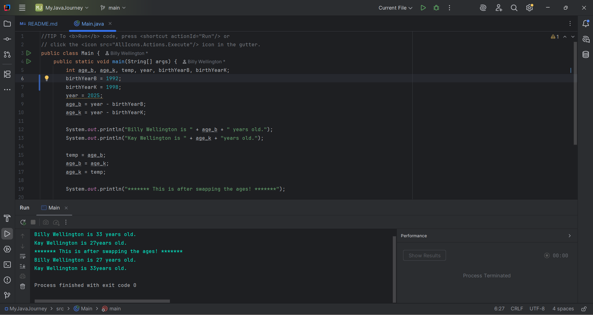
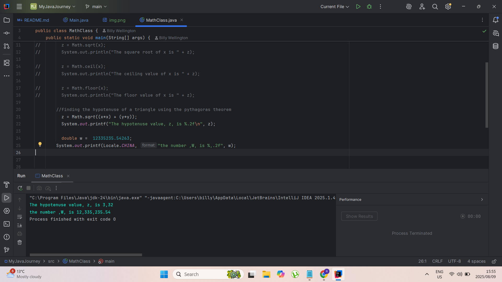

# Java Learning Journey 🚀

Welcome to my **Java Learning Repository**!  
This repo tracks my progress as I learn and explore **Java programming**, especially **Object-Oriented Programming (OOP)** concepts using IntelliJ IDEA.

---

## 📌 Purpose

This repository is meant to:
- Practice core Java syntax and structure.
- Learn and apply OOP principles like **classes**, **objects**, **inheritance**, **polymorphism**, **abstraction**, and **encapsulation**.
- Track my progress and growth in Java.

---

## 🛠️ Topics Covered

✔️ Basic Syntax  
✔️ Variables & Data Types  
✔️ Control Flow (if, switch, loops)  
✔️ Methods and Parameters  
✔️ Classes and Objects  
✔️ Constructors  
✔️ Inheritance  
✔️ Polymorphism  
✔️ Encapsulation  
✔️ Abstract Classes & Interfaces  
✔️ Exception Handling  
✔️ File I/O (soon...)

---

## 🧠 What I'm Using

| Tool | Purpose |
|------|---------|
| IntelliJ IDEA | Java IDE |
| Git & GitHub | Version control |
| Java SE 17+ | Language |
| README.md | Project documentation |

---

## ✅ Progress Tracker

* [ ] **Stage 1:** Java Basics
* [ ] **Stage 2:** Object-Oriented Programming (OOP)
* [ ] **Stage 3:** Collections & Data Structures
* [ ] **Stage 4:** File Handling & Advanced Features
* [ ] **Stage 5:** GUI Development
* [ ] **Stage 6:** Advanced Java (Threads, Packages, Deployment)

---
### **Stage 1 — Java Basics**

* [ ] Java tutorial for beginners ☕
* [ ] Variables ❌
* [ ] Swap two variables 💱
* [ ] User input ⌨️
* [ ] Expressions 🧮
* [ ] GUI intro 🚩
* [ ] Math class 📐
* [ ] Random numbers 🎲
* [ ] If statements 🚧
* [ ] Switches ⬇
* [ ] Logical operators ❗
* [ ] While loop 🔄
* [ ] For loop ➰
* [ ] Nested loops ➿
* [ ] Arrays 🚗
* [ ] 2D arrays 🚚
* [ ] String methods 💬
* [ ] Wrapper classes 🎁
* [ ] ArrayList 🧾
* [ ] 2D ArrayList 📜
* [ ] For-each loop 🔃
* [ ] Methods 📞
* [ ] Overloaded methods ☎️
* [ ] Printf 🖨️
* [ ] Final keyword ⛔

### **Stage 2 — Object-Oriented Programming**

* [ ] Objects (OOP) ☕
* [ ] Constructors 👷
* [ ] Variable scope 🌍
* [ ] Overloaded constructors 🍕
* [ ] ToString method 🎉
* [ ] Array of objects 🍱
* [ ] Object passing 🏬
* [ ] Static keyword ⚡
* [ ] Inheritance 👪
* [ ] Method overriding 🙅‍♂️
* [ ] Super keyword 🦸‍♂️
* [ ] Abstraction 👻
* [ ] Access modifiers 🔒
* [ ] Encapsulation 💊
* [ ] Copy objects 🖨️
* [ ] Interface 🦅
* [ ] Polymorphism 🏁
* [ ] Dynamic polymorphism ✨

### **Stage 3 — Error Handling & Files**

* [ ] Exception handling ⚠️
* [ ] File class 📁
* [ ] FileWriter (write to a file) 📝
* [ ] FileReader (read a file) 📖
* [ ] Audio 🔊

### **Stage 4 — GUI Development**

* [ ] GUI 🖼️
* [ ] Labels 👨‍💻
* [ ] Panels 🟥
* [ ] Buttons 🛎️
* [ ] BorderLayout 🧭
* [ ] FlowLayout 🌊
* [ ] GridLayout 🔳
* [ ] LayeredPane 📚
* [ ] Open a new GUI window 🗔
* [ ] JOptionPane 🛑
* [ ] Textfield 📛
* [ ] Checkbox ✔️
* [ ] Radio buttons 🔘
* [ ] Combobox 📑
* [ ] Slider 🌡️
* [ ] Progress bar 📊
* [ ] Menubar 🗄️
* [ ] Select a file 🔎
* [ ] Color chooser 🎨
* [ ] KeyListener 🚀
* [ ] MouseListener 🖱️
* [ ] Drag and drop 👈
* [ ] Key bindings ⌨️
* [ ] 2D graphics 🖍️
* [ ] 2D animation 👾

### **Stage 5 — Advanced Java**

* [ ] Generics ❓
* [ ] Serialization 🥣
* [ ] TimerTask ⌚
* [ ] Threads 🧵
* [ ] Multithreading 🧶
* [ ] Packages 📦
* [ ] Compile/run from command prompt 💽
* [ ] Executable (.jar) ☕

---

## 💻 How to Run the Java Files

Follow these steps to set up your environment and run the Java programs from this repository.

### 1️⃣ Install Java (JDK)

You’ll need **Java Development Kit (JDK)** installed.

#### **Windows**
1. Download the latest JDK from [Oracle Java Downloads](https://www.oracle.com/java/technologies/downloads/).
2. Run the installer and follow the on-screen instructions.
3. Verify installation:
   
```bash
   java -version
````

You should see the installed Java version.

#### **Mac**

1. Install via [Oracle Java Downloads](https://www.oracle.com/java/technologies/downloads/) **or** with Homebrew:

   ```bash
   brew install openjdk
   ```
2. Verify:

   ```bash
   java -version
   ```

#### **Linux (Ubuntu/Debian)**

```bash
sudo apt update
sudo apt install openjdk-17-jdk
java -version
```

### 2️⃣ Install IntelliJ IDEA

#### **Windows & Mac**

1. Download from [IntelliJ IDEA Download Page](https://www.jetbrains.com/idea/download/).
2. Install and open the application.

#### **Linux**

```bash
sudo snap install intellij-idea-community --classic
```

Or download the `.tar.gz` package from JetBrains and extract it manually.

### 3️⃣ Clone the Repository

Open your terminal (Command Prompt / PowerShell on Windows, Terminal on Mac/Linux) and run:

```bash
git clone https://github.com/billywellington/Java-Learning-OOP-.git
cd Java-Learning-OOP-
```

### 4️⃣ Open the Project in IntelliJ IDEA

1. Launch IntelliJ IDEA.
2. Go to **File → Open**.
3. Select the folder `Java-Learning-OOP-` you just cloned.
4. Wait for IntelliJ to index the project.

### 5️⃣ Run a Java File

1. In the **Project Explorer**, navigate to the `src` folder.
2. Open the `.java` file you want to run.
3. Click the green **Run ▶** button at the top-right corner.

✅ You are now ready to explore and run Java programs from this repository!


## 📸 Demo (Screenshots & GIFs)


### 📸 Screenshots

<br><br>

<br><br>


## 📚 Resources

- [Java Docs](https://docs.oracle.com/javase/tutorial/)
- [Baeldung](https://www.baeldung.com/java-tutorial)
- [W3Schools Java](https://www.w3schools.com/java/)

---

## 📜 License
MIT License — free to use and modify.

---
Made with ❤️ by **Billy Wellington**  

📧 Contact me: [billywellington24@gmail.com](mailto:billywellington24@gmail.com)
